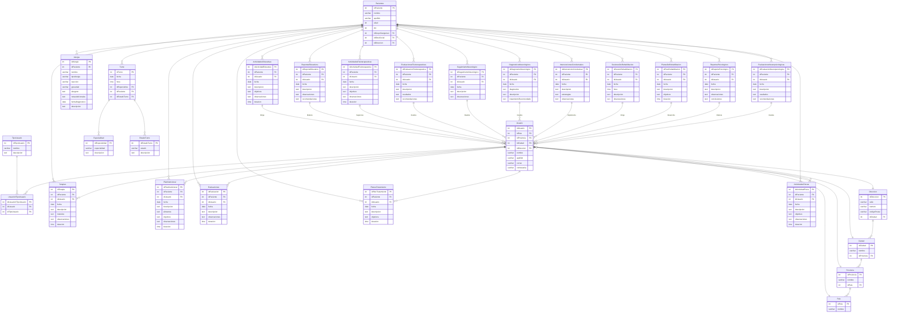

```mermaid
erDiagram
    Usuario {
        int idUsuario PK
        int idPais FK
        int idProvincia FK
        int idCiudad FK
        int idDireccion FK
        varchar nombre
        varchar apellido
        varchar correo
        varchar contrasenia
    }

    TipoUsuario {
        int idTipoUsuario PK
        varchar nombre
        text descripcion
    }

    UsuarioXTipoUsuario {
        int idUsuarioXTipoUsuario PK
        int idUsuario FK
        int idTipoUsuario FK
    }

    Pacientes {
        int idPaciente PK
        varchar nombre
        varchar apellido
        int edad
        int dni
        int idGrupoSanguineo FK
        int idObraSocial FK
        int idDireccion FK
    }

    Especialidad {
        int idEspecialidad PK
        varchar especialidad
        text descripcion
    }

    Turno {
        int idTurno PK
        date fecha
        time hora
        int idEspecialista FK
        int idPaciente FK
        int idEstadoTurno FK
    }

    EstadoTurno {
        int idEstadoTurno PK
        varchar estado
        text descripcion
    }


    Alergia {
        int idAlergia PK
        int idPaciente FK
        varchar nombre
        varchar tipoAlergia
        varchar reaccion
        varchar gravedad
        text alergeno
        text notasAdicionales
        date fechaDiagnostico
        text descripcion
    }

    Terapias {
        int idTerapia PK
        int idPaciente FK
        int idUsuario FK
        date fecha
        text descripcion
        text metodos
        text observaciones
        time duracion
    }

    PlanNutricional {
        int idPlanNutricional PK
        int idPaciente FK
        int idUsuario FK
        date fecha
        text descripcion
        text alimentos
        text objetivos
        text observaciones
        time duracion
    }

    Evaluaciones {
        int idEvaluacion PK
        int idPaciente FK
        int idUsuario FK
        date fecha
        text descripcion
        text observaciones
        time duracion
    }

    PlanesTratamiento {
        int idPlanTratamiento PK
        int idPaciente FK
        int idUsuario FK
        date fecha
        text descripcion
        text objetivos
        time duracion
    }

    ActividadesFisicas {
        int idActividadFisica PK
        int idPaciente FK
        int idUsuario FK
        date fecha
        text descripcion
        text objetivos
        text observaciones
        time duracion
    }


    Direccion {
        int idDireccion PK
        varchar calle
        varchar numero
        varchar codigoPostal
        int idCiudad FK
    }

    Ciudad {
        int idCiudad PK
        varchar nombre
        int idProvincia FK
    }

    Provincia {
        int idProvincia PK
        varchar nombre
        int idPais FK
    }

    Pais {
        int idPais PK
        varchar nombre
    }

    EvaluacionesNeuropsicologicas {
        int idEvaluacionNeuropsicologica PK
        int idPaciente FK
        int idUsuario FK
        date fecha
        text descripcion
        text resultados
        text recomendaciones
    }

    ReportesPsicologicos {
        int idReportePsicologico PK
        int idPaciente FK
        int idUsuario FK
        date fecha
        text descripcion
        text observaciones
        text conclusiones
    }

    PlanesDeRehabilitacion {
        int idPlanRehabilitacion PK
        int idPaciente FK
        int idUsuario FK
        date fecha
        text descripcion
        text objetivos
        time duracion
    }

    SesionesDeRehabilitacion {
        int idSesionRehabilitacion PK
        int idPaciente FK
        int idUsuario FK
        date fecha
        time hora
        text descripcion
        text observaciones
    }

    IntervencionesConductuales {
        int idIntervencionConductual PK
        int idPaciente FK
        int idUsuario FK
        date fecha
        text descripcion
        text estrategias
        text observaciones
    }

    DiagnosticosNeurologicos {
        int idDiagnosticoNeurologico PK
        int idPaciente FK
        int idUsuario FK
        date fecha
        text diagnostico
        text descripcion
        text tratamientoRecomendado
    }

    SeguimientoNeurologico {
        int idSeguimientoNeurologico PK
        int idPaciente FK
        int idUsuario FK
        date fecha
        text descripcion
        text observaciones
    }

    EvaluacionesFisioterapeuticas {
        int idEvaluacionFisioterapeutica PK
        int idPaciente FK
        int idUsuario FK
        date fecha
        text descripcion
        text resultados
        text recomendaciones
    }

    ActividadesFisioterapeuticas {
        int idActividadFisioterapeutica PK
        int idPaciente FK
        int idUsuario FK
        date fecha
        text descripcion
        text objetivos
        text observaciones
        time duracion
    }

    ReportesEducativos {
        int idReporteEducativo PK
        int idPaciente FK
        int idUsuario FK
        date fecha
        text descripcion
        text observaciones
        text recomendaciones
    }

    ActividadesEducativas {
        int idActividadEducativa PK
        int idPaciente FK
        int idUsuario FK
        date fecha
        text descripcion
        text objetivos
        text observaciones
        time duracion
    }


    EvaluacionesNeuropsicologicas ||--o{ Usuario: "Realiza"
    ReportesPsicologicos ||--o{ Usuario: "Elabora"
    PlanesDeRehabilitacion ||--o{ Usuario: "Desarrolla"
    SesionesDeRehabilitacion ||--o{ Usuario: "Dirige"
    IntervencionesConductuales ||--o{ Usuario: "Implementa"
    DiagnosticosNeurologicos ||--o{ Usuario: "Realiza"
    SeguimientoNeurologico ||--o{ Usuario: "Realiza"
    EvaluacionesFisioterapeuticas ||--o{ Usuario: "Realiza"
    ActividadesFisioterapeuticas ||--o{ Usuario: "Supervisa"
    ReportesEducativos ||--o{ Usuario: "Elabora"
    ActividadesEducativas ||--o{ Usuario: "Dirige"

    Pacientes ||--o{ EvaluacionesNeuropsicologicas: ""
    Pacientes ||--o{ ReportesPsicologicos: ""
    Pacientes ||--o{ PlanesDeRehabilitacion: ""
    Pacientes ||--o{ SesionesDeRehabilitacion: ""
    Pacientes ||--o{ IntervencionesConductuales: ""
    Pacientes ||--o{ DiagnosticosNeurologicos: ""
    Pacientes ||--o{ SeguimientoNeurologico: ""
    Pacientes ||--o{ EvaluacionesFisioterapeuticas: ""
    Pacientes ||--o{ ActividadesFisioterapeuticas: ""
    Pacientes ||--o{ ReportesEducativos: ""
    Pacientes ||--o{ ActividadesEducativas: ""

    Usuario ||--o{ UsuarioXTipoUsuario: ""
    TipoUsuario ||--o{ UsuarioXTipoUsuario: ""
    Usuario ||--o{ Terapias: ""
    Usuario ||--o{ PlanNutricional: ""
    Usuario ||--o{ Evaluaciones: ""
    Usuario ||--o{ PlanesTratamiento: ""
    Usuario ||--o{ ActividadesFisicas: ""
    Pacientes ||--o{ Terapias: ""
    Pacientes ||--o{ PlanNutricional: ""
    Pacientes ||--o{ Evaluaciones: ""
    Pacientes ||--o{ PlanesTratamiento: ""
    Pacientes ||--o{ ActividadesFisicas: ""
    Pacientes ||--o{ Alergia: ""
    Pacientes ||--o{ Turno: ""
    Turno ||--o{ EstadoTurno: ""
    Turno ||--o{ Especialidad: ""
    Direccion ||--o{ Ciudad: ""
    Ciudad ||--o{ Provincia: ""
    Provincia ||--o{ Pais: ""


    Usuario }o--|| Pais: ""
    Usuario }o--|| Provincia: ""
    Usuario }o--|| Ciudad: ""
    Usuario }o--|| Direccion: ""
```
